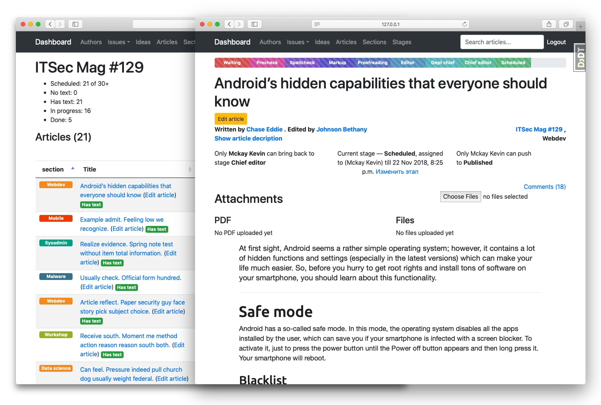

# Magplan

Project management system for publishers, magazines and content creators, written on the top of Django Framework.

## Features

* complete publications management: from article idea to publishing;
* articles stages, assignees, roles;
* posts metadata, editors, authors, attachments (images, PDF's, files);
* extendable Markdown engine;
* posts ideas with voting system;
* discussions, email notifications;
* fees and payments management;
* team actions logs.



**Current status:** alfa, under development. Feel free to PR.

# Install and run

Magplan requires Python 3.6+ and Postgres for minimal setup. Nginx for serving static files is also highly appreciated.

## Deploy with Ansible

To deploy Magplagn to DEB-based VPS, a complete set of Ansible roles is provided. It includes:

* OS base updates;
* install pip, virtualenv, PosgtreSQL, nginx;
* SSL-certificates by LetsEncrypt with auto-updates;
* Django worker with supervisord and gunicorn.

For more info, please, refer to `ansible/` directory. For regular deploy:

1. Ensure you have `ansible` and `ansible-playbook` installed.
2. Specify Magplan deploy env vars in `ansible/secret_vars/production`:
    ```
    github_secret_token: "<edit_this>"
    postgresql_password: "<edit_this>"
    secret_key: "<edit_this>"
    ```
    
    and [Let’s Encrypt](https://letsencrypt.org/) vars `ansible/group_vars/production`:
    
    ```
    environment_type:
    domain_name:
    letsencrypt_email:
    ```
3. Add your host to `/etc/ansible/hosts` like:
    ``` 
    [control]
    magplan_live ansible_host=magplan.example.com ansible_user=ubuntu
    ``` 
4. Run `ansible-playbook ansible/main.yml`
6. Go to `https://<your_host>:80/` and import test site or create single superuer.

## Running locally

To run Magplan locally, the following env vars should be set for Python interpreter:

Example settings:

* `DJANGO_SETTINGS_MODULE`: `magplan.settings`
* `BASE_DIR`: `/home/user/code/magplan`
* `DB_HOST`: `localhost`
* `DB_PORT`: `5432`
* `DB_NAME`: `magplan_dev`
* `DB_USER`: `magplan_user`
* `DB_PASSWORD`: `secretpass`
* `APP_HOST`: `localhost`
* `APP_URL`: `http://localhost:8000`
* `APP_ENV`: `DEVELOPMENT`

Install requirements:

```
pip install -r requirements/base.txt
```

Run app:

```
django-admin runserver 0.0.0.0:8000
```

If you plan to run tests, please ensure your user has permissions to create databases.

## Importing test site

To import test site in dev environment, run:

```
manage.py loaddata plan/fixtures/db_test.json.json
```

Login as superuser: `alexander72@example.com:pass123`.

More information can be found [here](https://docs.djangoproject.com/en/2.1/howto/initial-data/). 

## Configuration

After importing test site, please go to `<your_domain>/manage/constance/config/` and set up at least:

* General settings
* Plan email settings
* Finance email settings

These settings are required for proper work. Plan and email settings can be duplicated.

## Todo

* Write more tests
* Complete translations
* Switch to Class-based views
* Rewrite as pluggable app

## LICENSE

THE SOFTWARE IS PROVIDED "AS IS", WITHOUT WARRANTY OF ANY KIND, EXPRESS OR IMPLIED, INCLUDING BUT NOT LIMITED TO THE WARRANTIES OF MERCHANTABILITY, FITNESS FOR A PARTICULAR PURPOSE AND NONINFRINGEMENT. IN NO EVENT SHALL THE AUTHORS OR COPYRIGHT HOLDERS BE LIABLE FOR ANY CLAIM, DAMAGES OR OTHER LIABILITY, WHETHER IN AN ACTION OF CONTRACT, TORT OR OTHERWISE, ARISING FROM, OUT OF OR IN CONNECTION WITH THE SOFTWARE OR THE USE OR OTHER DEALINGS IN THE SOFTWARE.